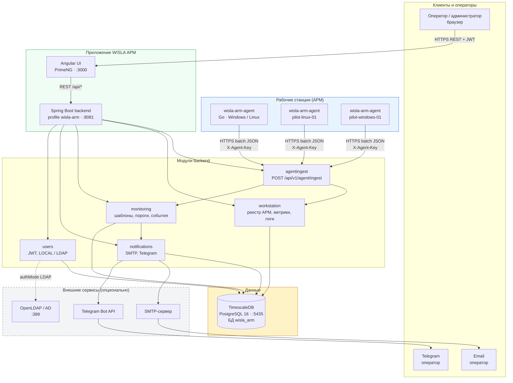
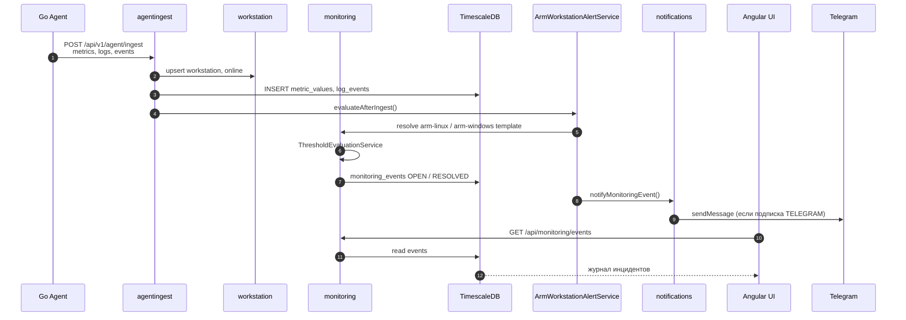
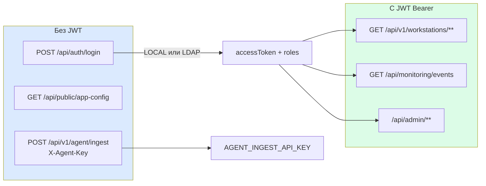
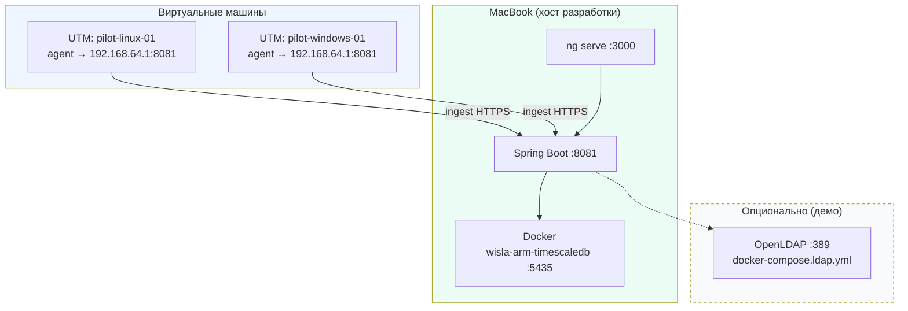
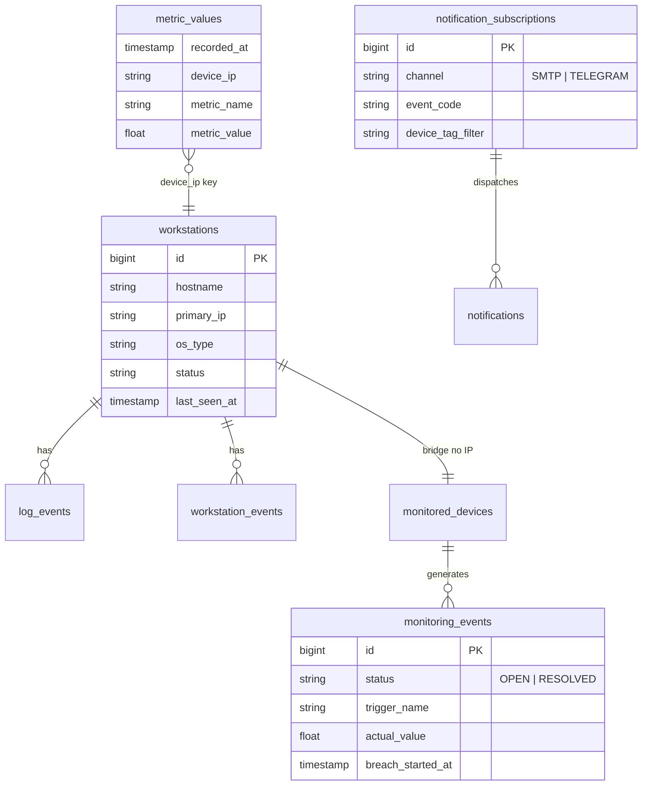
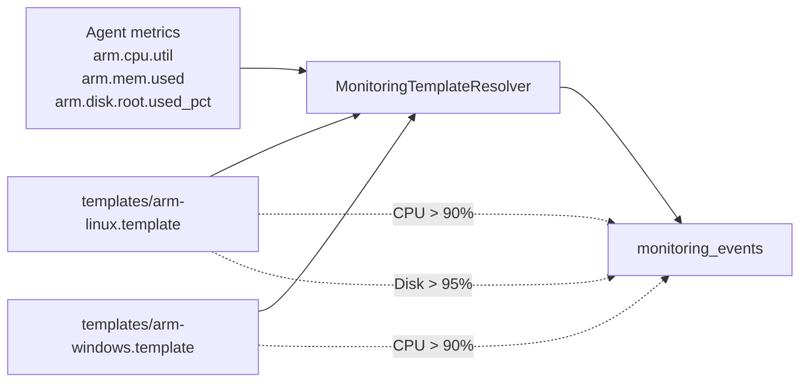

# Архитектурная схема WISLA АРМ

> Блок-схема компонентов, потоков данных и развёртывания MVP.  
> Краткая версия: [`../ARCHITECTURE.md`](../ARCHITECTURE.md) · Решения: [`../DECISIONS.md`](../DECISIONS.md)

---

## 1. Компоненты системы (блок-схема)

---

## 2. Поток данных: ingest → алерт → уведомление

---

## 3. Аутентификация

| Роль | Доступ |
|------|--------|
| VIEWER | Просмотр АРМ, событий, дашбордов |
| OPERATOR | + подписки на уведомления |
| ADMIN | + SMTP, LDAP, пользователи |

---

## 4. Развёртывание MVP (демо / пилот)

---

## 5. Модель данных (упрощённо)

---

## 6. Шаблоны мониторинга

---

## 7. Порты и технологии

| Компонент | Технология | Порт / URL |
|-----------|------------|------------|
| Agent | Go, gopsutil | исходящий → backend :8081 |
| Backend | Java 17, Spring Boot 3.4, Flyway | **8081** |
| Frontend | Angular 21, PrimeNG | **3000** |
| БД | TimescaleDB PG16 | **5435** → 5432 |
| LDAP (демо) | OpenLDAP | **389** |
| Swagger | springdoc | http://localhost:8081/swagger-ui.html |

---

## 8. Что отключено в MVP (fork NetworckScaner)

| Модуль NS | Статус в WISLA АРМ |
|-----------|-------------------|
| network.scan, scanjobs | скрыто в UI |
| SNMP collector | выключено |
| Kafka pipeline | `monitoring.kafka.enabled=false` |
| WISLA integration | stub / v2 |

---

## 9. Ключевые API

| Метод | Путь | Назначение |
|-------|------|------------|
| POST | `/api/v1/agent/ingest` | Приём метрик от агента |
| POST | `/api/auth/login` | JWT (LOCAL / LDAP) |
| GET | `/api/v1/workstations` | Реестр АРМ |
| GET | `/api/monitoring/events` | Журнал инцидентов |
| GET/POST | `/api/admin/system/notification-subscriptions` | Подписки алертов |

Полный контракт ingest: `docs/architecture/архитектура-и-техническая-реализация.docx` §4.3.
