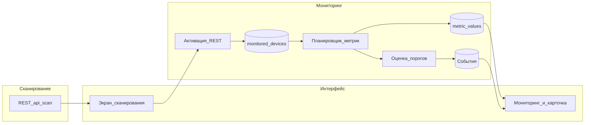

# Network Scanner

Веб-приложение для **сканирования сети** по заданным параметрам и **постановки обнаруженных устройств на мониторинг** с периодическим сбором метрик по SNMP и фиксацией событий при превышении порогов.

## Назначение и задачи

Основная задача системы — дать оператору единый интерфейс, в котором можно:

1. **Сканировать сеть** — задать подсеть в формате диапазона (`192.168.1.0-255`) или CIDR (`192.168.1.0/24`), **один или несколько методов обнаружения** (ICMP, TCP-порт, SNMP v1/v2/v3 и др.) с отдельными настройками для каждого метода, общий таймаут и число повторов.
2. **Поставить найденные устройства на мониторинг** — сохранить выбранные хосты в базе, назначить им **шаблон мониторинга** и далее автоматически опрашивать их, накапливать историю метрик и пороговые события.

Дополнительно приложение предоставляет:

- просмотр списка устройств на мониторинге, деталей по устройству, графиков метрик, конфигурации и бэкапов (где реализовано);
- раздел **событий** мониторинга;
- для роли администратора — управление пользователями.

Состав экранов и соответствие маршрутам приведены в разделе «Страницы веб-приложения» ниже.

## Страницы веб-приложения

Маршруты объявлены в [`frontend/src/app/app.routes.ts`](frontend/src/app/app.routes.ts). Шаблон `**` перенаправляет на корень; для авторизованного пользователя пустой путь `''` ведёт на `/scan`.

| Маршрут | Компонент | Описание |
|--------|-----------|----------|
| `/login` | `LoginPageComponent` | Вход в систему; `guestGuard` ограничивает доступ только для неавторизованных; данные передаются в `AuthService`. Внизу слева — кнопка однократной загрузки **демо-данных мониторинга** (7 устройств, шаблон `cisco-extended`, события и история метрик за 2 недели; `POST /api/debug/demo-monitoring-seed`, без авторизации; после успешного ответа кнопка блокируется в браузере). |
| `/` (родительский) | `MainWorkspaceComponent` | Оболочка после входа: боковое меню, выход, карточка пользователя; вложенный `RouterOutlet` для дочерних страниц. Защита `authGuard`. |
| `/scan` | `ScanPageComponent` | Параметры и **асинхронный** запуск (`ScanService`, `POST /api/scan/runs` → polling `GET /api/scan/runs/{id}`): **профиль доступа** (SNMP/SSH/HTTPS из настроек системы) и **несколько методов обнаружения** в одной задаче (чекбоксы ICMP, SNMP, TCP и др.) с портами для каждого метода. Во время скана — прогресс «X из Y адресов»; таблица результатов — после завершения (`GET /api/scan/runs/{id}/results`). Колонки **«Название»** (поле `name`, SNMP sysDescr при наличии) и **«Сканирование»** (статус каждого метода, зелёный/красный). При ненулевом списке устройств форма сворачивается до кнопки «Запустить сканирование» и ссылки «Все параметры». Постановка на мониторинг — `MonitoringService`: в попапе «Выбор шаблонов мониторинга» можно выбрать шаблоны вручную или включить **«Автоопределение»** (подбор по вендору, модели, прошивке и приоритету шаблона); запуск сканирования — **ADMIN** и **OPERATOR**. |
| `/scan-jobs` | `ScanJobsPageComponent` | Задачи **асинхронного** автосканирования (CRON и «Запустить сейчас» через `POST /api/scan-jobs/{id}/run`, статус в списке обновляется polling): плитка **«Обнаружено новых»** (число уникальных по IP адресов из последних результатов всех задач, ещё не на мониторинге); **по клику** — отдельный экран со списком этих устройств и постановкой на мониторинг по шаблону (как просмотр последнего результата задачи); список задач с CRON, включение/выключение, **редактирование** (подсеть, параметры сканирования, расписание, мониторинг — как при создании), ручной запуск и просмотр **последнего результата**; из результата можно выбрать устройства и поставить их на мониторинг (как на `/scan`). |
| `/monitoring` | `MonitoringPageComponent` | Список устройств на мониторинге: сводка по статусам, поиск по полям хоста, таблица/компактный список и переход в карточку по `device.id`. Чекбоксы в строках и в заголовке таблицы (с состоянием «частично выбрано») позволяют выделять несколько устройств; панель «Действия» над списком — массовое снятие с мониторинга, применение шаблона, изменение тегов и удаление (с подтверждением для опасных операций). В меню строки — те же одиночные действия; управление мониторингом и удаление — роли **ADMIN** и **OPERATOR**. Настройка столбцов (порядок, видимость, ширина — сохраняется для пользователя). |
| `/topology` | `TopologyPageComponent` | Топология сети: **Cytoscape.js**, контекстное меню (в т.ч. настройки объекта, смена вида узла), привязка узла к устройству мониторинга; для **группы** — фон PNG/JPEG/SVG в панели настроек (после сохранения в топологии); на **вложенном уровне** — ПКМ по пустому фону графа: **«Настройки слоя»** (имя, цвет подложки, изображение). В меню «⋯» у выбранной топологии для владельца/**ADMIN** — **«Редактировать»**: имя, «открывать по умолчанию», видимость и общий доступ (как у дашборда). Топология, открытая только на чтение (чужая или по общему доступу без прав владельца), отображается в **режиме просмотра**: без перетаскивания узлов и пунктов контекстного меню, ведущих к правкам. Создание связи между объектами — долгий ПКМ по исходному объекту с перетаскиванием к целевому; пункт «Сведения» у узла с привязанным устройством открывает карточку `/monitoring/:id`. При несохранённых изменениях графа уход со страницы (в т.ч. по ссылке) запрашивает подтверждение (`canDeactivate`). Доступ всем авторизованным пользователям (`authGuard`). |
| `/monitoring-templates` | `MonitoringTemplatesPageComponent` | Загрузка файлов шаблонов (.template), таблица пакетов, редактирование метаданных загруженных шаблонов (вендор, модель, прошивка, приоритет) и приоритета системных — через диалог «Редактировать», изменения после «Сохранить»; настройка ширины столбцов таблицы (сохраняется для пользователя); только **ADMIN** (`adminGuard`). |
| `/monitoring/:id` | `DeviceCardComponent` | Карточка устройства; дочерние пути (без пересоздания родителя): **`…/info`**, **`…/configuration`**, **`…/metrics`**, **`…/snapshot`**, **`…/item-config`**, **`…/events`**, **`…/config-management`** (`DeviceCardTabShellComponent`). Пустой сегмент после id перенаправляет на `info`. Вкладки: **Общая информация**, **Сетевые интерфейсы** (порты), **Графики метрик**, **Текущее состояние** (таблица последних значений), **Настройки мониторинга** (назначенные шаблоны и включение/отключение item), **События** (бейдж открытых), **Управление конфигурацией** (эталон, бэкапы, сравнение). |
| `/events` | `EventsPageComponent` | Журнал событий мониторинга: полоса карточек с количеством событий по уровням порога (по фильтру), сводка по странице, панель фильтров (даты, длительность, имя устройства, метрика, MAC — «Применить» / «Сбросить»), настройка столбцов таблицы (порядок, видимость и ширина — сохраняется для пользователя), колонка «Имя хоста» (SNMP sysName), пагинация. |
| `/dashboards` | `DashboardsListPageComponent` | Список дашбордов («мои» / «видимые мне»), создание, обновление, выбор дашборда «по умолчанию» для текущего пользователя. |
| `/dashboards/:id` | `DashboardDetailPageComponent` | Просмотр дашборда и сетка виджетов; виджеты **CLOCK**, **PROBLEMS** и **GRAPH** отображаются по сохранённым настройкам (часы; таблица событий мониторинга с фильтрами из полей виджета; график метрик по выбранным устройствам и item key). Для владельца/**ADMIN** — диалог создания/редактирования виджетов (редакторы по типам). |
| `/users` | `UsersPageComponent` | Управление пользователями; доступ только у **ADMIN** (`adminGuard`), данные через `UsersService`. Создание и редактирование профиля/пароля — в общем модальном окне `UserFormModalComponent`. Настройка ширины столбцов таблицы (сохраняется для пользователя). |
| `/system-settings` | `SystemSettingsPageComponent` | Настройка системы (только **ADMIN**, `adminGuard`): вкладки **«Профили доступа»** (SNMPv1/v2/v3, SSH, HTTPS для сканирования), **«Интеграция каталогов»** (LDAP/AD-подключение и fallback), **«Соответствие ролей»** (группа каталога → роль системы), **«Создание пользователя»** (поиск по LDAP-фильтру, маппинг атрибутов login/email/ФИО и создание локальной учётной записи из каталога), **«Почтовый сервер (SMTP)»** и **«Подписки уведомлений»**. |
| `/audit` | `AuditPageComponent` | Журнал аудита: вход и выход пользователей, мониторинг устройств, задачи автосканирования, шаблоны, топология, дашборды (время и логин); только **ADMIN** (`adminGuard`), данные через `SystemAuditService` (`GET /api/admin/audit/events`). Выход фиксируется при `POST /api/auth/logout` из клиента. Настройка ширины столбцов таблицы (сохраняется для пользователя). |

## Мониторинг и шаблоны

Сбор метрик и **параметры опроса SNMP** задаются через **версионированный пакет шаблонов** в `backend/src/main/resources/monitoring-templates/`:

- `manifest.template` — обфусцированный индекс пакета (`schemaVersion`, `packVersion`, `defaultTemplateId`, правила `vendor` / `modelRegex`, SNMP, `extends`); поля `file:` в manifest по-прежнему с суффиксом `.yaml`, на диске читается соответствующий `*.template`;
- `**/*.template` — обфусцированный **нативный экспорт Zabbix** (`zabbix_export`): UTF-8 YAML → reverse строки → Base64 (одна строка в файле).

Загрузка через UI: только файл `.template` (до 10 MB); после приёма содержимое сохраняется в БД как открытый YAML (`manifest_yaml` / `template_yaml`).

Подготовка файлов: `MonitoringTemplateObfuscatorMain` или `backend/scripts/ops/encode-monitoring-templates.sh` (из исходного `.yaml`).

### Формат пакета

```text
backend/src/main/resources/monitoring-templates/
  manifest.template
  vendors/network_generic_device_by_snmp.template
  os/linux_snmp_snmp/template_os_linux_snmp_snmp.template
```

### Что исполняется в runtime

- **items** опрашиваются по своему `delay`;
- **discovery_rules** выполняют SNMP walk и материализуют LLD-инстансы;
- **item_prototypes** превращаются в конкретные item keys вида `ifHCInOctets[Gi1]`;
- **trigger expressions** Zabbix (`last`, `avg`, `max`, арифметика, `and` / `or`) вычисляются по истории `metric_values`;
- **valuemaps** и **graphs** сохраняются как runtime metadata и используются для enriched state/events.

При активации устройства на мониторинг к записи привязываются `template_id`, `effective_template_id`, а также версия шаблона/пакета. Планировщик на бэкенде разрешает эффективный шаблон, выполняет discovery и polling по правилам Zabbix runtime, пишет значения в `metric_values` и `monitoring_item_state`, а затем рассчитывает trigger events в `monitoring_events`.

Реализация загрузки и компиляции шаблонов находится в `monitoring` (`MonitoringTemplateResolverImpl`), SNMP GET/WALK и discovery — в `network.scan` (`SnmpScanServiceImpl`), цикл исполнения runtime — в `monitoring` (`MetricCollectorServiceImpl`, `ThresholdEvaluationServiceImpl`).

### Дашборды

Подсистема **дашбордов** (таблицы `dashboards`, `dashboard_widgets`, REST в пакете `dashboards`) доступна в SPA: маршруты `/dashboards` и `/dashboards/:id` (`DashboardsService`).

## Поток данных



Ключевые REST-контроллеры: `SnmpScanController` (сканирование), `MonitoringController` и связанные эндпоинты мониторинга (список устройств, шаблоны, метрики, события).

### Формат ответа истории метрик устройства

Для вкладки графиков устройства `GET /api/monitoring/devices/{deviceId}/metrics` возвращает объект в **компактном формате** (графики строятся по нему в SPA):

- `chartPanels` — панели графиков из шаблона Zabbix (`graphs` и `graph_prototypes`): `panelKey`, `title`, `graphType`, `metricNames`, `rightAxisMetricNames`, а также **`series`** — ряды панели. Каждый ряд несёт метаданные один раз (`metricName`, `displayName`, `unit`, `scaledUnit`) и параллельные массивы точек: **`t`** (метки времени, epoch millis), **`v`** (сырые значения), **`sv`** (масштабированные значения; отсутствует, если масштабирование не применялось);
- `totalChartPanels` — полное количество панелей до среза (для пагинации);
- опциональные query-параметры **`panelsOffset`** (с 0) и **`panelsLimit`** — вернуть подмножество панелей для подгрузки по скроллу; без них в ответе все панели. Точки читаются из БД **только для метрик панелей текущего среза**;
- опциональный **`maxPoints`** — целевой максимум точек на ряд (децимация под отображение через `time_bucket`); `0` отключает децимацию, без параметра применяется значение по умолчанию.

Если метрика не упомянута в `graph_items` шаблона, она попадает в отдельную панель (один график = одна метрика).

Дашборд-виджет GRAPH использует `POST /api/monitoring/metrics/history-batch` — ответ тоже компактный (ряды с `t`/`v`/`sv`); в теле запроса можно передать `maxPoints`. Интеграционные эндпоинты Wisla (`/api/integration/wisla/...`) сохраняют прежний формат с полем `points` для обратной совместимости.

## Структура репозитория

| Каталог | Содержание |
|--------|------------|
| `backend/` | Spring Boot, JPA, Flyway-миграции в `src/main/resources/db/migration/`, manifest + обфусцированные Zabbix-шаблоны (`.template`) в `src/main/resources/monitoring-templates/` |
| `frontend/` | Одностраничное приложение Angular: страницы, сервисы, guards, аутентификация |
| `tools/` | Локальные инструменты сборки (при необходимости — например, вынесенный Maven) |

## Модули backend (`com.networkscanner.backend`)

| Модуль | Назначение |
|--------|------------|
| `network.scan` | Сканирование сети, разбор диапазонов IP, SNMP-опросы, DTO результатов сканирования, асинхронные запуски REST `/api/scan/runs` (статус, результаты, остановка) |
| `network.scanjobs` | Задачи автосканирования по CRON, хранение последнего результата, REST `/api/scan-jobs` (в т.ч. сводка «обнаружено без мониторинга» `GET /api/scan-jobs/discovered-not-monitored-summary` и список устройств `GET /api/scan-jobs/discovered-not-monitored-devices`) |
| `monitoring` | Устройства на мониторинге, метрики, события, разрешение шаблонов, пороги |
| `inventory` | Бэкапы и эталонные конфигурации оборудования |
| `users` | Пользователи, JWT, Spring Security, административный API |
| `accessprofiles` | Профили доступа (SNMPv1/v2/v3, SSH, HTTPS) для сканирования: CRUD `/api/admin/access-profiles`, список `/api/access-profiles` |
| `dashboards` | Сущности и API дашбордов и виджетов |
| `topology` | Сохранённые топологии сети: сущность, JSON-документ графа, REST `/api/topologies` (права как у дашбордов) |
| `config` | Сквозная конфигурация (CORS, глобальная обработка ошибок и т.п.) |

Внутри модулей принята схема подпакетов: `api`, `impl`, `model`, `dto`, `repository`, `web` (и при необходимости `mapper`, `util`).

## Структура frontend (`src/app`)

- **`pages/`** — экраны: сканирование, мониторинг, шаблоны мониторинга, карточка устройства, события, дашборды, вход, пользователи.
- **`services/`** — работа с API: `scan.service`, `monitoring.service`, `users.service`, `dashboards.service` и др.
- **Guards и `auth.*`** — защита маршрутов и передача учётных данных в запросах.
- **`shared-ui.css`** — общие стили, в том числе **единый layout страниц со списками** (подключается глобально в `angular.json`).

### Единый layout списков (UI)

Для экранов с таблицами и фильтрами используется один шаблон:

- **`list-page-card`** — сетка-обёртка секции (`content-card` + этот класс).
- **`section-heading`** — заголовок и подпись слева, **`list-page-heading-actions`** — кнопки справа.
- **`list-summary-grid`** / **`list-summary-tile`** — 3–4 плитки краткой сводки.
- **`list-filters`** — строка фильтров в сетке (поиск по мере ввода, если данные локальные или API это позволяет).
- **`list-filter-panel`** — оформленная панель для более сложных фильтров (как на `/events` и вкладке событий устройства).
- Дублирующий поиск в **caption** таблицы PrimeNG не используется: один инпут в блоке фильтров.
- У **`p-table`** задаётся **`[alwaysShowPaginator]="false"`**, чтобы скрывать пагинатор, если все строки помещаются на одной странице.

Подход применён на `/scan` (результаты), `/monitoring`, `/monitoring-templates`, `/events`, `/users`, `/dashboards`, `/dashboards/:id`, а также во вкладках карточки устройства (сетевые интерфейсы, события, управление конфигурацией).

Подробности по командам Angular CLI, сборке и тестам фронтенда — в [frontend/README.md](frontend/README.md).

## Запуск (кратко)

1. **База данных** — PostgreSQL; параметры подключения — см. таблицу ниже (`DB_*`). Схема создаётся и обновляется **Flyway** при старте приложения.
2. **Backend** — из каталога `backend/` стандартным способом Spring Boot / Maven (`./mvnw spring-boot:bootRun` или сборка JAR), порт по умолчанию **8081**.
3. **Frontend** — из каталога `frontend/` (`ng serve`), по умолчанию **http://localhost:3000/**. URL API обычно настраивается в конфигурации фронтенда под ваш backend.

Полный перечень переменных окружения backend — в разделе [«Переменные окружения backend»](#переменные-окружения-backend).

## Переменные окружения backend

Параметры задаются переменными окружения или свойствами Spring Boot. В [`backend/src/main/resources/application.properties`](backend/src/main/resources/application.properties) используется вид `${ИМЯ_ПЕРЕМЕННОЙ:значение_по_умолчанию}`: если переменная не задана, берётся значение после двоеточия.

**Профили** (`SPRING_PROFILES_ACTIVE`) накладывают дополнительные файлы:

| Профиль | Назначение |
|--------|------------|
| `prod` | Продакшен: без демо/Swagger, укороченные таймауты Kafka, `KAFKA_ADMIN_AUTO_CREATE=false` |
| `prod-low-latency` | Вместе с `prod`: меньше задержка Kafka, ниже пиковый throughput |
| `prod-max-throughput` | Вместе с `prod`: выше throughput Kafka, выше latency батчей |
| `collector` | Только сбор метрик и публикация в `monitoring.polled` |
| `evaluator` | Только оценка порогов (`monitoring.evaluated`) |
| `writer` | Только запись в PostgreSQL |
| `kafka-all` | Все роли Kafka в одном процессе (dev/малые стенды) |

Примеры: `SPRING_PROFILES_ACTIVE=prod`, `SPRING_PROFILES_ACTIVE=prod,collector`, `SPRING_PROFILES_ACTIVE=prod,prod-low-latency`.

Колонка **«По умолчанию»** — для запуска без профиля `prod` (локальная разработка, `application.properties`). В профиле **`prod`** часть значений переопределяется в [`application-prod.properties`](backend/src/main/resources/application-prod.properties) (указано в примечаниях).

### База данных и пул соединений

| Переменная | Назначение | Допустимые значения | По умолчанию | Рекомендуется |
|------------|------------|---------------------|--------------|---------------|
| `DB_URL` | JDBC URL PostgreSQL (JPA и Flyway) | `jdbc:postgresql://хост:порт/БД` | `jdbc:postgresql://localhost:5435/networkscanner` | URL боевой БД с TLS, если требуется политикой |
| `DB_USERNAME` | Пользователь БД | строка | `networkscanner` | Отдельный пользователь с минимальными правами |
| `DB_PASSWORD` | Пароль БД | строка | `networkscanner` | Секрет из vault/окружения, не в репозитории |
| `DB_HIKARI_MAX_POOL_SIZE` | Размер пула HikariCP | целое ≥ 1 | `128` в `prod` / `collector` | ≥ числа потоков collector + запас (см. `MONITORING_COLLECTOR_THREADS`) |
| `DB_HIKARI_MIN_IDLE` | Минимум idle-соединений | целое ≥ 0 | `10` (`evaluator`), `12` (`writer`) | Как в профиле роли |

### Приложение, безопасность, CORS, отладка

| Переменная | Назначение | Допустимые значения | По умолчанию | Рекомендуется |
|------------|------------|---------------------|--------------|---------------|
| `APP_CORS_ALLOWED_ORIGINS` | Разрешённые Origin для браузера (через запятую) | URL | `http://localhost:3000,http://localhost:4200` | Внешний URL фронтенда за nginx (`https://…`) |
| `JWT_SECRET` | Секрет подписи JWT | строка (достаточно длинная) | встроенный dev-ключ | Случайный секрет в prod |
| `JWT_EXPIRATION_MS` | Время жизни токена, мс | целое > 0 | `43200000` (12 ч) | По политике ИБ (часто 8–12 ч) |
| `DEBUG_MODE` | Флаг отладочного режима для UI (`GET /api/debug/config`) | `true` / `false` | `false` | `false` в prod |
| `APP_INTEGRATION_SOURCE_SYSTEM` | Идентификатор источника в событиях Wisla | строка | пусто | Уникальный код инсталляции NS |
| `APP_INTEGRATION_WISLA_EVENTS_ENABLED` | Публикация событий Wisla в Kafka | `true` / `false` | `true` | `true`, если Wisla подключена |
| `APP_INTEGRATION_WISLA_EVENTS_AVAILABILITY_HEARTBEAT_ENABLED` | Периодическая публикация snapshot в `wisla.availability` | `true` / `false` | `true` | `true` для синхронизации статуса wiSLA |
| `APP_INTEGRATION_WISLA_EVENTS_AVAILABILITY_HEARTBEAT_MS` | Интервал availability heartbeat, мс | целое > 0 | `300000` | ≤ stale-threshold wiSLA (обычно 5 мин) |
| `APP_INTEGRATION_WISLA_KAFKA_BROKER_METADATA_PATH` | Путь REST метаданных брокера для Wisla | путь | `/api/wisla/kafka-broker-metadata` | По контракту интеграции |
| `APP_INTEGRATION_WISLA_KAFKA_*` | Параметры SASL/SSL для metadata API (protocol, mechanism, JAAS, truststore/keystore) | как в Kafka | пусто | Заполнить при защищённом кластере |
| `APP_LOGGING_FILE_PATH` | Каталог лог-файлов | путь | `./logs` | Постоянный том на сервере |
| `APP_LOGGING_FILE_NAME` | Имя файла лога | имя файла | `backend.log` | По соглашению ops |
| `APP_LOGGING_ROLLING_MAX_FILE_SIZE` | Ротация: размер файла | `10MB`, `100MB`, … | `10MB` | `50–100MB` при высокой нагрузке |
| `APP_LOGGING_ROLLING_MAX_HISTORY_DAYS` | Ротация: хранить дней | целое | `14` | 14–30 |
| `APP_LOGGING_ROLLING_TOTAL_SIZE_CAP` | Ротация: суммарный лимит | `2GB`, … | `2GB` | По диску |

Уровни логирования: `LOGGING_LEVEL_ROOT`, `LOGGING_LEVEL_KAFKA`, `LOGGING_LEVEL_SPRING_KAFKA`, `LOGGING_LEVEL_MONITORING`, `LOGGING_LEVEL_SNMP_SCAN_SERVICE` — стандартные уровни SLF4J (`TRACE`, `DEBUG`, `INFO`, `WARN`, `ERROR`); по умолчанию `INFO` / `WARN` для Kafka.

### Мониторинг — планировщик collector (`MetricCollectorServiceImpl`)

Цикл сбора: при включённом pre-SNMP ICMP — **фаза 1** (ICMP по всем устройствам, опционально SNMP probe), **фаза 1b** (lightweight для недоступных), **фаза 2** (полный SNMP только для «доступных»).

| Переменная | Назначение | Допустимые значения | По умолчанию | Рекомендуется |
|------------|------------|---------------------|--------------|---------------|
| `MONITORING_COLLECTOR_ENABLED` | Включить планировщик collector | `true` / `false` | `true` | `true` на роли collector; `false` на evaluator/writer |
| `MONITORING_COLLECT_INTERVAL_MS` | Пауза между циклами сбора, мс | целое ≥ 1 | `60000` | `60000` при 1k+ устройств; согласовать с SNMP `delay` в шаблонах |
| `MONITORING_COLLECTOR_THREADS` | Потоки полного SNMP (фаза 2) | целое ≥ 1 | `10` (`prod`: `12`, `collector`: `96`) | CPU×2…×4 на dedicated collector; не выше возможностей БД/Kafka |
| `MONITORING_COLLECTOR_PER_DEVICE_TIMEOUT_MS` | Таймаут полного опроса одного устройства, мс | целое ≥ 1 | `30000` (`prod`/`collector`: `60000`) | `60000` при SNMPv3 и тяжёлых walk |
| `MONITORING_COLLECTOR_PRE_SNMP_ICMP_ENABLED` | ICMP-фильтр перед SNMP | `true` / `false` | `true` | `true` — не тратить SNMP на явно мёртвые хосты |
| `MONITORING_COLLECTOR_PRE_SNMP_ICMP_TIMEOUT_MS` | Таймаут ICMP в фазе 1, мс | целое ≥ 1 | `3000` | `3000–5000` |
| `MONITORING_COLLECTOR_PRE_SNMP_ICMP_THREADS` | Потоки ICMP в фазе 1 | целое ≥ 1 | как `MONITORING_COLLECTOR_THREADS` | Равно или чуть больше потоков collector |
| `MONITORING_COLLECTOR_PRE_SNMP_ICMP_FAIL_POLICY` | Поведение при неуспешном ICMP | `snmp_probe` — быстрый SNMP probe, при успехе хост идёт в фазу 2; `skip_only` (алиасы `skip-only`, `skip`) — сразу lightweight без probe | `snmp_probe` | **`snmp_probe`**, если ICMP блокируют файрволом, а SNMP доступен; **`skip_only`**, если probe лишний и нужен минимальный цикл |
| `MONITORING_COLLECTOR_PRE_SNMP_SNMP_PROBE_TIMEOUT_MS` | Таймаут SNMP probe при `snmp_probe`, мс | целое ≥ 1 | `1500` | `1500–3000` |
| `MONITORING_COLLECTOR_LIGHTWEIGHT_PER_DEVICE_TIMEOUT_MS` | Таймаут lightweight-сбора (DOWN), мс | целое ≥ 1 | `8000` | `8000` |
| `MONITORING_ICMP_ATTEMPTS` | Число попыток ICMP (общие проверки) | целое ≥ 1 | `3` | `3` |
| `MONITORING_ICMP_TIMEOUT_MS` | Таймаут одной попытки ICMP, мс | целое ≥ 1 | `1000` | `1000–2000` |

Свойство Spring для политики ICMP: `monitoring.collector.pre-snmp-icmp.fail-policy` ([`application.properties:52`](backend/src/main/resources/application.properties)).

### Мониторинг — обновление доступности (`MonitoringAvailabilityRefreshService`)

Отдельный цикл ICMP/доступности, запись в `availability_history`, события Wisla availability.

| Переменная | Назначение | Допустимые значения | По умолчанию | Рекомендуется |
|------------|------------|---------------------|--------------|---------------|
| `MONITORING_AVAILABILITY_REFRESH_ENABLED` | Включить сервис | `true` / `false` | `true` | `true` |
| `MONITORING_AVAILABILITY_REFRESH_INTERVAL_MS` | Интервал цикла, мс | целое ≥ 1 | `60000` | `60000` |
| `MONITORING_AVAILABILITY_REFRESH_THREADS` | Потоки опроса | целое ≥ 1 | `16` | `16–32` на крупных инсталляциях |
| `MONITORING_AVAILABILITY_REFRESH_NETWORK_TIMEOUT_MS` | Сетевой таймаут ICMP, мс | целое ≥ 1 | `2000` (`prod`: `1500`) | `1500–2000` |
| `MONITORING_AVAILABILITY_REFRESH_PER_DEVICE_TIMEOUT_MS` | Таймаут на устройство, мс | целое ≥ 1 | `8000` (`prod`: `3000`) | `3000` в prod при массовых DOWN |
| `MONITORING_AVAILABILITY_REFRESH_BATCH_SIZE` | Размер пакета перед flush в БД | целое ≥ 1 | `100` (`prod`: `500`) | `500` при 1k+ устройств |
| `MONITORING_AVAILABILITY_REFRESH_STATE_HEARTBEAT_MS` | Период heartbeat состояния UP, мс | целое ≥ 0 | `300000` | `300000` (5 мин) |
| `MONITORING_AVAILABILITY_REFRESH_HISTORY_DOWN_SAMPLE_MS` | Сэмплирование истории для стабильного DOWN, мс | целое ≥ 0 | `180000` (`prod`: `600000`) | `600000` в prod — меньше INSERT |

### Мониторинг — шаблоны, JS, триггеры

| Переменная | Назначение | Допустимые значения | По умолчанию | Рекомендуется |
|------------|------------|---------------------|--------------|---------------|
| `MONITORING_SYSTEM_TEMPLATE_DIRS` | Каталоги системных шаблонов | пути через `:` / `;` | `monitoring-templates` | classpath + внешний том при кастомизации |
| `MONITORING_SYSTEM_TEMPLATE_CLASSPATH_FALLBACK` | Читать шаблоны из classpath, если нет на диске | `true` / `false` | `true` | `true` |
| `MONITORING_DEFAULT_MACRO_DONORS` | ID donor-модулей макросов | список через запятую | `generic-snmp-macros,vfs-fs-macros,icmp-ping-macros` | Не менять без понимания пакета |
| `MONITORING_JS_ENGINE_SOFT_RESET_INTERVAL_MS` | Интервал мягкого сброса Graal JS, мс (`0` = выкл.) | целое ≥ 0 | `0` | `0` или `3600000` при утечках памяти |
| `MONITORING_JS_ENGINE_SOFT_RESET_MIN_EVALUATIONS` | Сброс после N успешных eval | целое ≥ 1 | `50000` | `50000` |
| `MONITORING_TRIGGER_ENGINE_EXTENDED_FUNCTIONS_ENABLED` | Расширенные функции в выражениях триггеров | `true` / `false` | `true` | `true`, если шаблоны их используют |

### Kafka — пайплайн мониторинга

| Переменная | Назначение | Допустимые значения | По умолчанию | Рекомендуется |
|------------|------------|---------------------|--------------|---------------|
| `KAFKA_BOOTSTRAP_SERVERS` | Брокеры Kafka | `host:port,...` | `localhost:9094` | Адреса prod-кластера |
| `MONITORING_KAFKA_ENABLED` | Включить интеграцию Kafka мониторинга | `true` / `false` | `true` | `true` при split-ролях |
| `MONITORING_KAFKA_EVALUATOR_ENABLED` | Consumer оценки порогов | `true` / `false` | `true` | `true` только на evaluator |
| `MONITORING_KAFKA_WRITER_ENABLED` | Consumer записи в БД | `true` / `false` | `true` | `true` только на writer |
| `MONITORING_KAFKA_PARTITIONS` | Число партиций при auto-create | целое ≥ 1 | `6` | ≥ суммы consumer evaluator+writer |
| `MONITORING_KAFKA_REPLICATION_FACTOR` | RF при auto-create | целое ≥ 1 | `1` | `3` в prod-кластере |
| `MONITORING_KAFKA_LISTENER_CONCURRENCY` | Потоки `@KafkaListener` на consumer | целое ≥ 1 | `3` (`prod`: `6`) | Не больше партиций топика |
| `MONITORING_KAFKA_PUBLISHER_SEND_TIMEOUT_MS` | Таймаут send producer, мс | целое ≥ 1 | `2000` (`prod`/`collector`: `1500`) | `1500` fast-fail при деградации Kafka |
| `MONITORING_KAFKA_MAX_MESSAGE_BYTES` | Лимит сообщения топика (байты) | целое | `2097152` (2 MiB) | Согласовать с broker `message.max.bytes` |
| `MONITORING_KAFKA_PUBLISHER_MAX_RECORD_BYTES` | Порог chunking батча collector | целое | `1900000` | Чуть ниже max message |
| `MONITORING_KAFKA_POLLED_TOPIC` | Топик сырых опросов | имя топика | `monitoring.polled` | По runbook |
| `MONITORING_KAFKA_EVALUATED_TOPIC` | Топик после evaluator | имя топика | `monitoring.evaluated` | По runbook |
| `MONITORING_KAFKA_WISLA_*_TOPIC` | Топики Wisla (availability, incidents, monitor-state) | имя топика | см. properties | По [INTEGRATION_WISLA_EVENTS.md](INTEGRATION_WISLA_EVENTS.md) |
| `MONITORING_KAFKA_EVALUATOR_GROUP` / `MONITORING_KAFKA_WRITER_GROUP` | `group.id` consumer | строка | `cg_eval` / `cg_writer` | Уникальны на инсталляцию |
| `MONITORING_KAFKA_CACHE_MAX_DEVICES` | Размер кэша устройств в consumer | целое | `10000` | По числу устройств |
| `MONITORING_KAFKA_CACHE_EXPIRE_AFTER_MINUTES` | TTL кэша, мин | целое | `30` | `30` |
| `KAFKA_ADMIN_AUTO_CREATE` | Автосоздание топиков | `true` / `false` | `true` (`prod`: `false`) | **`false` в prod** — топики создаёт ops |

### Kafka — клиент Spring (`spring.kafka.*`)

Типичные переменные (полный список — в `application.properties` и `application-prod.properties`):

| Переменная | Назначение | Допустимые значения | По умолчанию (dev) | Рекомендуется |
|------------|------------|---------------------|--------------------|---------------|
| `KAFKA_PRODUCER_RETRIES` | Повторы producer | целое ≥ 0 | `3` (`prod`: `2`) | `2` в prod |
| `KAFKA_REQUEST_TIMEOUT_MS` | request.timeout.ms | мс | `10000` (`prod`: `5000`) | `5000` fast-fail |
| `KAFKA_DELIVERY_TIMEOUT_MS` | delivery.timeout.ms | мс | `20000` (`prod`: `12000`) | `12000` |
| `KAFKA_COMPRESSION_TYPE` | Сжатие | `none`, `gzip`, `lz4`, `zstd`, … | `lz4` | `lz4` (баланс); `zstd` в `prod-max-throughput` |
| `KAFKA_BATCH_SIZE` | batch.size | байты | `65536` (`prod`: `131072`) | Профиль `prod-max-throughput` / `prod-low-latency` |
| `KAFKA_LINGER_MS` | linger.ms | мс | `20` | Меньше — ниже latency; больше — выше throughput |
| `KAFKA_MAX_REQUEST_SIZE` / `KAFKA_FETCH_MAX_BYTES` / `KAFKA_MAX_PARTITION_FETCH_BYTES` | Лимиты размера запроса/ответа | байты | 2–4 MiB | Согласовать с broker и `MONITORING_KAFKA_MAX_MESSAGE_BYTES` |
| `KAFKA_MAX_POLL_RECORDS` | Записей за poll consumer | целое | `100` (`prod`: `1000`) | Выше на writer, ниже на low-latency |
| `KAFKA_FETCH_MIN_BYTES` / `KAFKA_FETCH_MAX_WAIT_MS` | Батчинг fetch | байты / мс | `1` / `500` | См. overlay-профили |
| `KAFKA_MAX_POLL_INTERVAL_MS` | max.poll.interval.ms | мс | `300000` (`writer`: `600000`) | Запас под долгие batch writer |
| `KAFKA_SESSION_TIMEOUT_MS` / `KAFKA_HEARTBEAT_INTERVAL_MS` | Сессия consumer group | мс | `30000` / `10000` | Стандартные значения Kafka |
| `KAFKA_ASSIGNMENT_STRATEGY` | Стратегия rebalance | FQCN | CooperativeSticky | Не менять без причины |
| `KAFKA_LISTENER_POLL_TIMEOUT_MS` | poll-timeout listener | мс | — (`prod`: `1500`) | `800–1500` |

**Broker (docker-compose):** `KAFKA_MESSAGE_MAX_BYTES`, `KAFKA_REPLICA_FETCH_MAX_BYTES`, `KAFKA_SOCKET_REQUEST_MAX_BYTES` — лимиты на стороне брокера; должны быть ≥ `KAFKA_MAX_MESSAGE_BYTES`.

### Сканирование сети и задачи CRON

Ручное сканирование (`/scan`, `POST /api/scan/runs`) и автосканирование (`/scan-jobs`, CRON) используют **раздельные пулы потоков и семафоры**. Тяжёлый CRON не забирает потоки у оператора на ручном скане.

#### Уровни исполнения

| Уровень | Потоки в логах | Что делает |
|---------|----------------|------------|
| **run-executor** | `scan-run-manual-*`, `scan-run-job-*` | Координатор одного запуска: прогресс в БД, вызов `SnmpScanService.scan()` |
| **subnet-executor** | `subnet-scan-manual-*`, `subnet-scan-job-*` | Параллельные пробы по IP внутри одной подсети (ICMP/SNMP/TCP…) |
| **Семафор** | — | Сколько полных проходов `scan()` одного типа (manual/job) могут идти одновременно |

Планировщик CRON (`scan.jobs.scheduler.pool-size`) только **ставит задачу в очередь**; само сканирование идёт через пулы `network.scan.job.*`.

При переполнении очереди срабатывает `CallerRunsPolicy` — задача выполняется в вызывающем потоке (скан замедляется, но не теряется).

После **перезапуска сервера** незавершённые запуски (`QUEUED`/`RUNNING`) помечаются как прерванные; автоскан по CRON начнётся заново по расписанию.

#### Ручное сканирование (`network.scan.manual.*`)

| Переменная окружения | Property | Назначение | По умолчанию |
|----------------------|----------|------------|--------------|
| `NETWORK_SCAN_MANUAL_SUBNET_EXECUTOR_CORE` | `network.scan.manual.subnet-executor.core-pool-size` | Базовое число потоков проб IP | `12` |
| `NETWORK_SCAN_MANUAL_SUBNET_EXECUTOR_MAX` | `network.scan.manual.subnet-executor.max-pool-size` | Максимум потоков проб IP | `24` |
| `NETWORK_SCAN_MANUAL_SUBNET_EXECUTOR_QUEUE` | `network.scan.manual.subnet-executor.queue-capacity` | Очередь задач проб IP | `1024` |
| `NETWORK_SCAN_MANUAL_MAX_CONCURRENT_SUBNET_SCANS` | `network.scan.manual.max-concurrent-subnet-scans` | Параллельных ручных сканов подсети | `2` |
| `NETWORK_SCAN_MANUAL_RUN_EXECUTOR_CORE` | `network.scan.manual.run-executor.core-pool-size` | Базовое число координаторов | `2` |
| `NETWORK_SCAN_MANUAL_RUN_EXECUTOR_MAX` | `network.scan.manual.run-executor.max-pool-size` | Максимум координаторов | `4` |
| `NETWORK_SCAN_MANUAL_RUN_EXECUTOR_QUEUE` | `network.scan.manual.run-executor.queue-capacity` | Очередь координаторов | `32` |

#### Автосканирование (`network.scan.job.*`)

| Переменная окружения | Property | Назначение | По умолчанию |
|----------------------|----------|------------|--------------|
| `NETWORK_SCAN_JOB_SUBNET_EXECUTOR_CORE` | `network.scan.job.subnet-executor.core-pool-size` | Базовое число потоков проб IP | `16` |
| `NETWORK_SCAN_JOB_SUBNET_EXECUTOR_MAX` | `network.scan.job.subnet-executor.max-pool-size` | Максимум потоков проб IP | `48` |
| `NETWORK_SCAN_JOB_SUBNET_EXECUTOR_QUEUE` | `network.scan.job.subnet-executor.queue-capacity` | Очередь задач проб IP | `2048` |
| `NETWORK_SCAN_JOB_MAX_CONCURRENT_SUBNET_SCANS` | `network.scan.job.max-concurrent-subnet-scans` | Параллельных автосканов подсети | `4` |
| `NETWORK_SCAN_JOB_RUN_EXECUTOR_CORE` | `network.scan.job.run-executor.core-pool-size` | Базовое число координаторов | `4` |
| `NETWORK_SCAN_JOB_RUN_EXECUTOR_MAX` | `network.scan.job.run-executor.max-pool-size` | Максимум координаторов | `8` |
| `NETWORK_SCAN_JOB_RUN_EXECUTOR_QUEUE` | `network.scan.job.run-executor.queue-capacity` | Очередь координаторов | `64` |

#### Общие параметры

| Переменная окружения | Property | Назначение | По умолчанию | Рекомендуется |
|----------------------|----------|------------|--------------|---------------|
| `NETWORK_SCAN_INVOKE_BATCH_SIZE` | `network.scan.invoke-batch-size` | Сколько IP отправляется в subnet-пул за один проход координатора | `256` | `256` для /24 |
| `SCAN_JOBS_SCHEDULER_POOL_SIZE` | `scan.jobs.scheduler.pool-size` | Потоки планировщика CRON (только диспетчеризация) | `8` | `8` |

#### Как настраивать

1. **Семафор (`max-concurrent-subnet-scans`)** — главный лимит параллелизма. Один /24 ≈ один permit. Если одновременно 6 job по CRON — поднимайте `NETWORK_SCAN_JOB_MAX_CONCURRENT_SUBNET_SCANS` (осторожно: растёт нагрузка на сеть и CPU).
2. **subnet `max-pool-size`** — скорость одного скана (/24 с SNMP: до ~254 параллельных проб, ограничено пулом). Для одного быстрого /24 достаточно `16–24`; `48` — когда несколько job идут параллельно.
3. **run `max-pool-size`** — сколько координаторов одновременно. Обычно ≥ семафора; при дефолтах manual `4` и job `8` запас есть.
4. **Ручной скан важнее фона** — дефолты уже смещены в пользу manual (отдельные пулы). При агрессивном CRON не уменьшайте `NETWORK_SCAN_MANUAL_*` ради job.
5. **Ориентир по CPU:** суммарный `subnet max` (manual + job) ≈ `24 + 48 = 72` потока в пике — имеет смысл на сервере с 8+ ядрами; на слабом хосте уменьшите job-пул первым.

#### Примеры

**Много CRON-задач (10+), ручной скан редко**

```properties
NETWORK_SCAN_JOB_MAX_CONCURRENT_SUBNET_SCANS=6
NETWORK_SCAN_JOB_SUBNET_EXECUTOR_MAX=64
NETWORK_SCAN_MANUAL_MAX_CONCURRENT_SUBNET_SCANS=2
```

**Приоритет оператора, CRON в фоне**

```properties
NETWORK_SCAN_MANUAL_SUBNET_EXECUTOR_MAX=32
NETWORK_SCAN_MANUAL_MAX_CONCURRENT_SUBNET_SCANS=2
NETWORK_SCAN_JOB_MAX_CONCURRENT_SUBNET_SCANS=2
NETWORK_SCAN_JOB_SUBNET_EXECUTOR_MAX=24
```

**Слабый сервер (4 CPU)**

```properties
NETWORK_SCAN_MANUAL_SUBNET_EXECUTOR_MAX=8
NETWORK_SCAN_JOB_SUBNET_EXECUTOR_MAX=16
NETWORK_SCAN_JOB_MAX_CONCURRENT_SUBNET_SCANS=2
```

> Старые переменные `NETWORK_SCAN_SUBNET_EXECUTOR_*`, `NETWORK_SCAN_MAX_CONCURRENT_SUBNET_SCANS`, `NETWORK_SCAN_RUN_EXECUTOR_*` **не используются** — заменены на `NETWORK_SCAN_MANUAL_*` и `NETWORK_SCAN_JOB_*`.

### Локальный тестовый LDAP/LDAPS

Для проверки интеграции каталога в `docker-compose.yml` добавлен сервис `ldap` (образ `osixia/openldap`) с автозагрузкой тестовых пользователей из `ldap/bootstrap/10-networkscanner-users.ldif`.

- Запуск LDAP: `docker compose up -d ldap`
- LDAP URL: `ldap://localhost:389`
- LDAPS в локальном тестовом контейнере отключен (для простого запуска без TLS-ошибок).
- Base DN: `dc=networkscanner,dc=local`
- Bind DN (админ): `cn=admin,dc=networkscanner,dc=local`, пароль: `admin`
- Service bind DN: `uid=svc-ldap,ou=people,dc=networkscanner,dc=local`, пароль: `svc-ldap-pass`
- Тестовые пользователи:
  - `uid=admin,ou=people,dc=networkscanner,dc=local` / пароль `password` / email `admin@example.com`
  - `uid=operator,ou=people,dc=networkscanner,dc=local` / пароль `operator123` / email `operator@example.com`
  - `uid=viewer,ou=people,dc=networkscanner,dc=local` / пароль `viewer123` / email `viewer@example.com`

Рекомендуемый LDAP-фильтр для страницы `Настройка системы`:
`(&(objectClass=inetOrgPerson)(uid={login}))`

#### Быстрый локальный старт (без ручной ACL-настройки)

Используйте bind под встроенным админом LDAP (root DN), чтобы вход работал сразу после `docker compose up -d ldap`:

- Протокол: `LDAP`
- Сервер: `localhost`
- Порт: `389`
- Base DN: `dc=networkscanner,dc=local`
- Тип аутентификации: `SIMPLE`
- Bind DN: `cn=admin,dc=networkscanner,dc=local`
- Bind password: `admin`
- LDAP-фильтр: `(&(objectClass=inetOrgPerson)(uid={login}))`
- Атрибуты маппинга:
  - login: `uid`
  - email: `mail`
  - display name: `displayName`

Тестовые входы в режиме `LDAP` на форме логина:

- `admin / password`
- `operator / operator123`
- `viewer / viewer123`

Если нужен bind через сервисный аккаунт `svc-ldap`, после чистого развертывания требуется отдельно применить ACL (или использовать подготовленный скрипт/ldif для ACL).

### Профили производительности Kafka (prod)

Базовый прод-профиль:

- `SPRING_PROFILES_ACTIVE=prod` — сбалансированные настройки для крупных инсталляций (1000+ устройств), fast-fail публикация и умеренный throughput/latency.

Дополнительные overlay-профили (включаются вместе с `prod`):

- `SPRING_PROFILES_ACTIVE=prod,prod-low-latency` — минимизирует задержку доставки сообщений Kafka.
  - Влияние: меньше `batch-size` и `linger.ms`, меньше `fetch.min.bytes`, чаще poll/send.
  - Компромисс: больше сетевых запросов и ниже пиковая пропускная способность.
- `SPRING_PROFILES_ACTIVE=prod,prod-max-throughput` — максимизирует устойчивую пропускную способность Kafka.
  - Влияние: больше `batch-size`, `linger.ms`, `fetch.min.bytes`, `max.poll.records`.
  - Компромисс: выше latency отдельных сообщений/батчей.

Лимит размера записи Kafka (по умолчанию 2 MiB, env `KAFKA_MAX_MESSAGE_BYTES` / `KAFKA_MAX_REQUEST_SIZE`):

- **Producer/consumer (Spring):** `application.properties` — `spring.kafka.producer.properties.max.request.size`, `spring.kafka.consumer.properties.fetch.max.bytes`.
- **Broker (docker-compose):** `KAFKA_CFG_MESSAGE_MAX_BYTES`, `KAFKA_CFG_REPLICA_FETCH_MAX_BYTES`, `KAFKA_CFG_SOCKET_REQUEST_MAX_BYTES`.
- **Топики:** при `spring.kafka.admin.auto-create=true` — `monitoring.kafka.max-message-bytes` на `monitoring.polled` / `monitoring.evaluated` (+ `.DLT`). На уже существующем кластере: `backend/scripts/ops/configure-kafka-max-message-bytes.sh`.
- **Chunking:** `monitoring.kafka.publisher.max-record-bytes` (дефолт ~1,9 MiB) — запасной split крупных батчей collector.

### High-load capacity model (split roles)

Рекомендуемый режим для 5k+ устройств — раздельные роли:

- `SPRING_PROFILES_ACTIVE=prod,collector` — только сбор и публикация в `monitoring.polled`.
- `SPRING_PROFILES_ACTIVE=prod,evaluator` — только оценка порогов и публикация в `monitoring.evaluated`.
- `SPRING_PROFILES_ACTIVE=prod,writer` — только запись в PostgreSQL.

Базовая формула планирования нагрузки:

- `events_per_second = devices × avg_polled_items_per_cycle / collect_interval_seconds`
- `required_partitions >= target_evaluator_consumers + target_writer_consumers`
- `writer_batch_time_ms` должен оставаться существенно меньше `max.poll.interval.ms` даже на p99.

Базовые SLO для high-load:

- rebalance rate для `cg_eval`/`cg_writer` стремится к нулю в steady-state;
- consumer lag не растёт монотонно при постоянной входной нагрузке;
- p95/p99 времени batch-обработки writer стабильны и укладываются в бюджет цикла.

## Ёмкость `metric_values` (TimescaleDB)

История числовых метрик хранится в hypertable **`metric_values`** (сырые точки для триггеров Zabbix). Политики (миграции `V54`/`V55`):

- **retention сырых данных** — 10 суток;
- **compression** — чанки старше 2 суток;
- **continuous aggregate** `metric_values_1h` — почасовые средние для графиков по данным **старше 7 суток** (retention агрегата 90 суток); последние 7 суток читаются из сырых `metric_values`, при пересечении диапазона — объединение raw + hourly.

В каждую точку записываются **`unit_label`** (единицы на графиках и автомасштаб bps/Mbps, B/GB и т.д.), **`item_key`**, **`instance_key`**. Метаданные шаблона (`template_id`, `value_text`, …) в историю не дублируются — они в `monitoring_item_state`. При чтении истории без `unit_label` (старые строки, CAGG) единица подставляется из шаблона или `monitoring_item_state`.

При **снятии устройства с мониторинга** (`POST /api/monitoring/deactivate`) строки по `device_ip` удаляются из `metric_values`, `metric_values_1h`, `availability_history` и `telemetry_history`.

Диагностика на сервере:

```bash
bash backend/scripts/ops/check-metric-values-storage.sh
```

Разовая очистка «сирот» (IP уже не в `monitored_devices`):

```sql
DELETE FROM metric_values mv
WHERE NOT EXISTS (SELECT 1 FROM monitored_devices d WHERE d.ip = mv.device_ip);
```

## Нагрузочная валидация мониторинга (1000+ устройств)

Рекомендуемый сценарий для проверки устойчивости цикла мониторинга при массовой недоступности и флаппинге.

1. Подготовить пул из 1000+ устройств (или эмуляторов), где часть адресов стабильно `UP`, часть стабильно `DOWN`, часть периодически меняет состояние.
2. Включить мониторинг с профилем collector и проверить параметры в `backend/src/main/resources/application.properties`: `monitoring.collector-threads`, `monitoring.collector.per-device-timeout-ms`, `monitoring.collector.pre-snmp-icmp.*`, `monitoring.collector.lightweight.per-device-timeout-ms`, `monitoring.availability-refresh.*`, `monitoring.kafka.publisher.send-timeout-ms`.

   Цикл `MetricCollectorServiceImpl` при `monitoring.collector.pre-snmp-icmp.enabled=true` (по умолчанию) работает в три шага: **фаза 1** — параллельный ICMP по всем устройствам (при fail опционально быстрый SNMP probe, `fail-policy=snmp_probe` \| `skip_only`); **фаза 1b** — lightweight-сбор для недоступных (ICMP-item’ы, `zabbix[host,snmp,available]=0`, без discovery/SNMP walk); **фаза 2** — полный SNMP только для eligible. Устройства с мониторинга не снимаются; при восстановлении ping хост снова попадает в фазу 2.

   Ключевые переменные collector — в таблице [«Мониторинг — планировщик collector»](#мониторинг--планировщик-collector-metriccollectorserviceimpl) (`MONITORING_COLLECTOR_PRE_SNMP_ICMP_*`, `MONITORING_COLLECTOR_LIGHTWEIGHT_PER_DEVICE_TIMEOUT_MS` и др.).
3. Провести два прогона не менее 15-20 минут:
   - Kafka доступна и стабильна;
   - Kafka недоступна или с искусственными задержками.
4. Снять метрики по завершению: длительность циклов, количество `success/timeout/kafka_failed/other_failed`, объём записей в `availability_history` и `telemetry_history`, состояние CPU/пула потоков backend.

Критерии успешности:

- цикл `MetricCollectorServiceImpl` завершается предсказуемо и не «зависает» при деградации Kafka;
- при недоступной Kafka ошибки отрабатывают в fast-fail режиме без каскадного исчерпания рабочих потоков;
- для стабильных `DOWN` устройств история пишется с сэмплированием (объём INSERT заметно ниже, чем при записи каждый цикл);
- события изменения статуса (`UP`/`DOWN`) сохраняются без потери.

### Runbook: чеклист перед нагрузочным прогоном

- Проверить число партиций Kafka относительно суммарной concurrency групп `cg_eval` и `cg_writer`.
- Проверить, что роли запущены отдельно и без лишних consumer с тем же `group.id`.
- Проверить лимиты соединений PostgreSQL и значения `spring.datasource.hikari.*` для evaluator/writer.
- Проверить, что `monitoring.collector.per-device-timeout-ms` согласован с фактическими SNMP timeout/retry.
- При массовых DOWN проверить в логах collector: `phase1 ... snmp_eligible=... unreachable=...`, отсутствие 60s timeout на живых из‑за одного мёртвого хоста; при ICMP-only блокировке на части сети рассмотреть `fail-policy=snmp_probe`.
- На прогоне собирать метрики: consumer lag, rebalance count, batch latency writer/evaluator, DB pool saturation, CPU/RAM по ролям.

## Документация REST API (Swagger)

Интерактивное описание REST API бэкенда формируется библиотекой **springdoc-openapi** (`springdoc-openapi-starter-webmvc-ui` в `backend/pom.xml`). Заголовок и схема **Bearer JWT** задаются в [`OpenApiConfig.java`](backend/src/main/java/com/networkscanner/backend/config/OpenApiConfig.java).

В [`SecurityConfig.java`](backend/src/main/java/com/networkscanner/backend/users/config/SecurityConfig.java) публичный доступ к Swagger UI и JSON OpenAPI включается только если в конфигурации включены `springdoc.swagger-ui.enabled` и `springdoc.api-docs.enabled` (по умолчанию **true** в `application.properties`). Профиль **`prod`** подключает [`application-prod.properties`](backend/src/main/resources/application-prod.properties), где документация и демо-эндпоинт отключены по умолчанию (`SPRING_PROFILES_ACTIVE=prod`).

При стандартном порте бэкенда **8081** (см. `server.port` в `application.properties`) и включённом springdoc:

- **Swagger UI:** http://localhost:8081/swagger-ui.html
- **Спецификация OpenAPI (JSON):** http://localhost:8081/v3/api-docs

Для другого хоста или порта подставьте соответствующий базовый URL. Чтобы вызывать защищённые методы из Swagger UI, сначала получите JWT через `POST /api/auth/login` (в ответе также приходит `defaultDashboardId` текущего пользователя), затем нажмите **Authorize** и введите токен для схемы **bearerAuth** (Bearer JWT).

**Асинхронное сканирование:** ручной запуск — `POST /api/scan/runs` (202, тело `ScanRequest`), статус — `GET /api/scan/runs/{id}`, результаты после `SUCCESS` — `GET /api/scan/runs/{id}/results`, остановка — `POST /api/scan/runs/{id}/stop`. Автосканирование: `POST /api/scan-jobs/{id}/run` (202, `{ runId, … }`); CRON использует тот же фоновый механизм. Синхронный `POST /api/scan/snmp` удалён.

## Интеграция с Wisla (NS-1)

Для bootstrap/re-sync интеграции NS -> Wisla добавлен endpoint:

- `GET /api/integration/wisla/v1/monitored-devices` (Bearer JWT, роль `ADMIN`).

Smoke-док контракта, лимитов пагинации и примера ответа: [INTEGRATION_WISLA_BOOTSTRAP_API.md](INTEGRATION_WISLA_BOOTSTRAP_API.md).

## Интеграция с Wisla (NS-2)

Для событийной интеграции NS -> Wisla добавлены Kafka-топики:

- `wisla.availability`
- `wisla.incidents`
- `wisla.monitor-state`

Схемы payload, ключи идемпотентности и smoke-инструкции: [INTEGRATION_WISLA_EVENTS.md](INTEGRATION_WISLA_EVENTS.md).

## Интеграционные контракты Wisla (NS-3)

Machine-readable артефакты и process эволюции контракта:

- OpenAPI snapshot bootstrap: [docs/contracts/wisla/openapi-wisla-bootstrap.json](docs/contracts/wisla/openapi-wisla-bootstrap.json)
- JSON Schema событий:
  - [docs/contracts/wisla/schemas/probe-availability-update.schema.json](docs/contracts/wisla/schemas/probe-availability-update.schema.json)
  - [docs/contracts/wisla/schemas/external-incident-upsert.schema.json](docs/contracts/wisla/schemas/external-incident-upsert.schema.json)
  - [docs/contracts/wisla/schemas/monitor-state-snapshot.schema.json](docs/contracts/wisla/schemas/monitor-state-snapshot.schema.json)
- Versioning/deprecation policy: [docs/contracts/wisla/CONTRACT_VERSIONING.md](docs/contracts/wisla/CONTRACT_VERSIONING.md)
- Changelog контракта: [docs/contracts/wisla/CONTRACT_CHANGELOG.md](docs/contracts/wisla/CONTRACT_CHANGELOG.md)
- NS-4 runbook (идентификаторы и корреляция): [docs/contracts/wisla/IDENTIFIERS_AND_CORRELATION_RUNBOOK.md](docs/contracts/wisla/IDENTIFIERS_AND_CORRELATION_RUNBOOK.md)
- NS-5 runbook (security/quotas/latency/replay): [docs/contracts/wisla/SECURITY_QUOTAS_LATENCY_RUNBOOK.md](docs/contracts/wisla/SECURITY_QUOTAS_LATENCY_RUNBOOK.md)

Настройка дашборда по умолчанию для текущего пользователя обновляется через `PATCH /api/me/default-dashboard` (поле `defaultDashboardId`, допускается `null` для сброса). Топология по умолчанию для страницы `/topology` — `PATCH /api/me/default-topology` (`defaultTopologyId`, `null` снимает выбор); в ответе `POST /api/auth/login` также приходит `defaultTopologyId` (и сбрасывается на сервере, если топология стала недоступна).

Топологии мониторинга (черновик UI на `/topology`): CRUD **`/api/topologies`** (поле **`document`**, **`PRIVATE` / `SHARED`**, **`sharedUserIds`**, **`autosave`**; в ответе также **`rootLayerBackdropColor`**; в **`PUT`** опционально **`rootLayerBackdropColor`** — пустая строка сбрасывает цвет подложки корневого уровня) и объекты графа: **`GET/POST /api/topologies/{id}/objects`**, **`GET /api/topologies/{id}/objects/{objectId}`** (один объект), **`PUT /api/topologies/{id}/objects/{objectId}`** (частичное обновление: NODE — центр, **nodeKind**, **deviceId** / **clearDevice: true**, **layerBackdropColor** / пустая строка для сброса подложки; GROUP — центр и/или **frameWidth** / **frameHeight**, **frameBorderColor** / пустая строка для сброса, **layerBackdropColor**; EDGE — **lineColor** / пустая строка для сброса; **groupId** — родительская группа, **clearGroup: true** — вынести из группы; общее поле **name**), **`PUT /api/topologies/{id}/objects/layout-batch`** (пакетно: массив **`items`** с полями **`objectId`**, опционально **positionX** / **positionY** и для GROUP — **frameWidth** / **frameHeight**; одна транзакция БД, ответ **204**), **`DELETE /api/topologies/{id}/objects/{objectId}`** (удаление объекта и инцидентных рёбер; права как у дашбордов). Фон слоя (изображение) только у **GROUP**: **`POST /api/topologies/{id}/objects/{objectId}/layer-background`** (multipart **`file`**, PNG/JPEG/SVG до 5 МБ), **`GET`** / **`DELETE`** того же пути; в JSON объекта у группы — **`layerBackgroundPresent`**, **`layerBackdropColor`** (цвет подложки задаётся и для NODE, и для GROUP, и для корня через **`rootLayerBackdropColor`** у топологии).

**`POST /api/debug/demo-monitoring-seed`** (тег **Отладка** в Swagger) доступен без JWT только если `app.demo-monitoring-seed-enabled=true` и Spring Security явно разрешает анонимный вызов; при `false` эндпоинт закрыт (`denyAll`), а сервис при включённом пути отвечает **404** «Функция недоступна». В профиле **`prod`** демо по умолчанию выключено.

Убедитесь, что SNMP-доступ и сетевая доступность целевых хостов соответствуют политике безопасности вашей среды.
